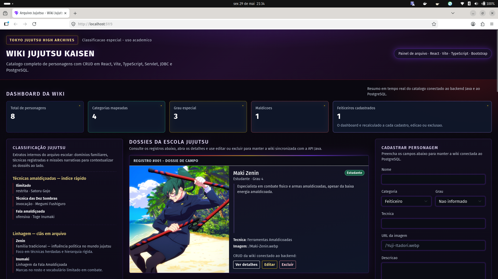
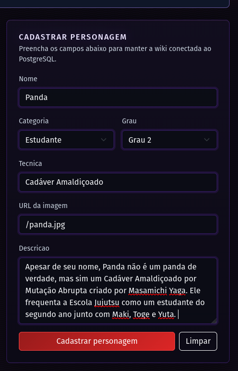
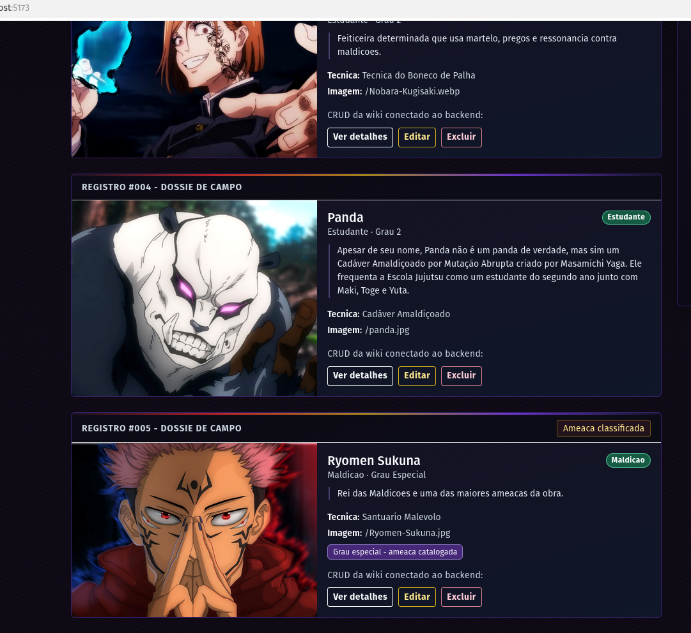
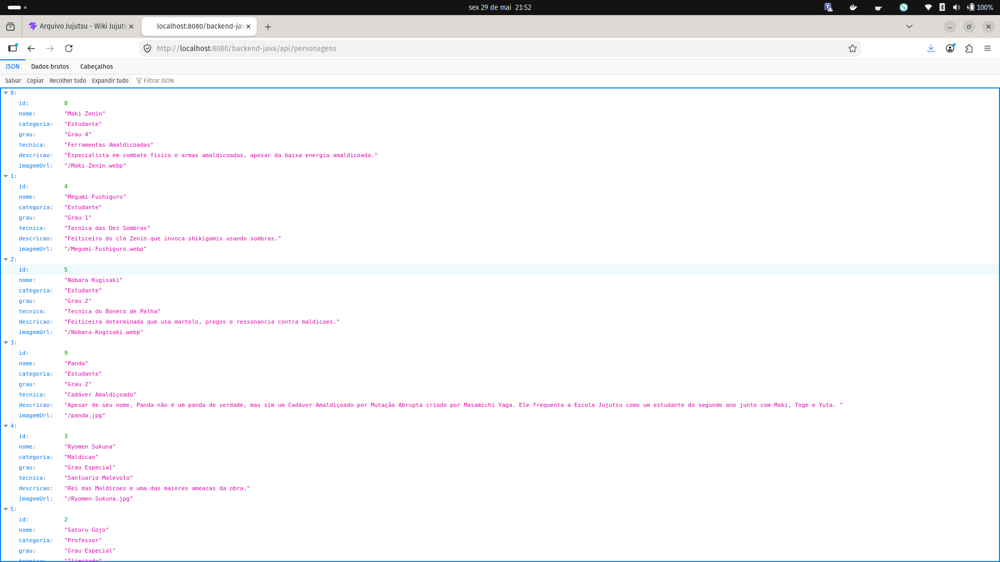

# Wiki Jujutsu Kaisen

## Integrante

- Karoline Albuquerque de Assis

## Tema

Wiki de personagens de Jujutsu Kaisen.

## Descricao

A aplicacao permite cadastrar, listar, visualizar, editar e excluir personagens do universo de Jujutsu Kaisen. O front-end foi desenvolvido em React com TypeScript e Bootstrap, consumindo uma API Java com Servlets e JDBC. Os dados sao persistidos em um banco PostgreSQL.

## Tecnologias

- React
- Vite
- TypeScript
- Bootstrap
- Java 17
- Servlets/JSP
- JDBC
- Maven
- PostgreSQL
- Docker

## Arquitetura

O projeto esta dividido em tres partes principais:

- `src/`: front-end React, com componentes, interfaces TypeScript, pagina principal e servico de consumo da API.
- `backend-java/`: back-end Java, com modelo `Personagem`, `ConnectionFactory`, `PersonagemDAO` e `PersonagemServlet`.
- `database/schema.sql`: script de criacao da tabela `personagens` e insercao dos dados iniciais.

Fluxo da aplicacao:

1. O React chama a API em `http://localhost:8080/backend-java/api/personagens`.
2. O `PersonagemServlet` recebe as requisicoes HTTP e retorna JSON.
3. O `PersonagemDAO` executa as operacoes no PostgreSQL usando JDBC.
4. A interface atualiza a lista e o dashboard apos cadastro, edicao ou exclusao.

## Banco de dados

Nome do banco:

```text
wiki_jujutsu_kaisen
```

Tabela principal:

```text
personagens
```

Campos principais:

- `id`
- `nome`
- `categoria`
- `grau`
- `tecnica`
- `descricao`
- `imagem_url`

Para criar o banco manualmente:

```bash
psql -U postgres -c "CREATE DATABASE wiki_jujutsu_kaisen;"
psql -U postgres -d wiki_jujutsu_kaisen -f database/schema.sql
```

## Como rodar com Docker

Na raiz do projeto:

```bash
docker compose up --build
```

Servicos:

- Front-end: `http://localhost:5173`
- Back-end: `http://localhost:8080/backend-java/api/personagens`
- PostgreSQL: `localhost:5433`

## Como rodar o back-end manualmente

Entre na pasta do back-end:

```bash
cd backend-java
```

Compile o projeto:

```bash
mvn clean package
```

Publique o arquivo gerado em um servidor Tomcat 10:

```text
backend-java/target/backend-java.war
```

Contexto esperado:

```text
http://localhost:8080/backend-java
```

Variaveis de conexao aceitas pelo back-end:

```bash
DB_URL=jdbc:postgresql://localhost:5432/wiki_jujutsu_kaisen
DB_USER=postgres
DB_PASSWORD=postgres
```

## Como rodar o front-end manualmente

Na raiz do projeto:

```bash
npm install
npm run dev
```

URL padrao da API:

```text
http://localhost:8080/backend-java/api
```

## Endpoints

- `GET /api/personagens`
- `GET /api/personagens/{id}`
- `POST /api/personagens`
- `PUT /api/personagens/{id}`
- `DELETE /api/personagens/{id}`

Exemplo de JSON para cadastro:

```json
{
  "nome": "Megumi Fushiguro",
  "categoria": "Estudante",
  "grau": "Grau 1",
  "tecnica": "Tecnica das Dez Sombras",
  "descricao": "Usuario da tecnica herdada do cla Zenin.",
  "imagemUrl": "/Megumi-Fushiguro.webp"
}
```

## CORS

O CORS foi configurado no `PersonagemServlet`, permitindo que o front-end React acesse a API Java em outro endereco local. A configuracao libera os metodos `GET`, `POST`, `PUT`, `DELETE` e `OPTIONS`, alem do cabecalho `Content-Type`.

Origens liberadas:

- `http://localhost:5173`
- `http://127.0.0.1:5173`
- `http://localhost:5174`
- `http://127.0.0.1:5174`
- `http://localhost`
- `http://127.0.0.1`

## Funcionalidades

- Listagem de personagens vindos do banco de dados.
- Cadastro de personagem.
- Visualizacao dos detalhes.
- Edicao de personagem.
- Exclusao de personagem.
- Dashboard com contadores.
- Layout responsivo.
- Rodape com integrante, data e disciplina.

## Prints da aplicacao

### Tela principal

### Cadastro de personagem

### Personagem cadastrado na lista

### API retornando personagens


## Video explicativo

Adicionar aqui o link do video explicativo.

## Repositorio

Adicionar aqui o link do repositorio no GitHub.
